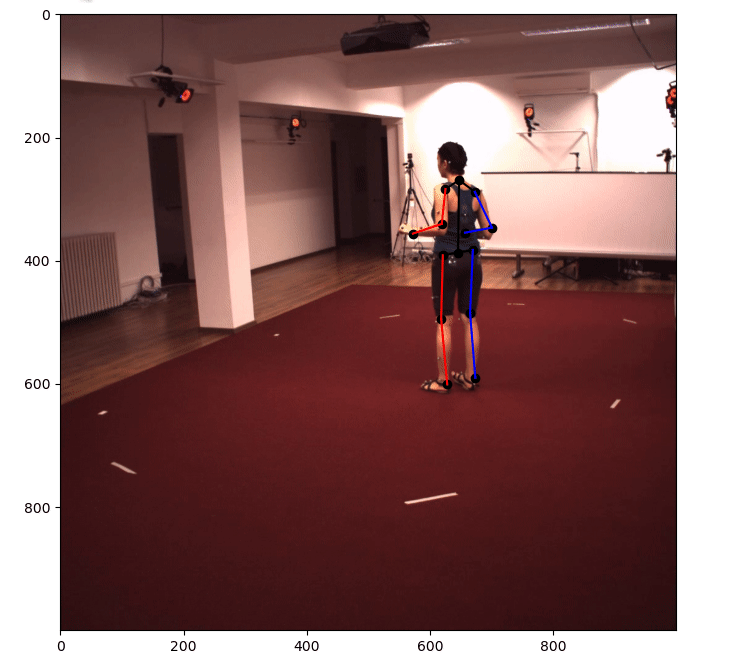

# H36M Visualizer



Just a simple 14jnt visualizer for H36M files. The dataset is expected to follow the directory structure generated by (this repo)[https://github.com/anibali/h36m-fetch]

### Arguments
```
--dpath dataset base path, the parent above processed and extracted directory
--act action file (e.g. Directions-1)
--subj subjects among ("S1", "S5", "S6", "S7", "S8", "S9", "S11")
--cam camera ids (54138969, 55011271, 58860488, 60457274)
```